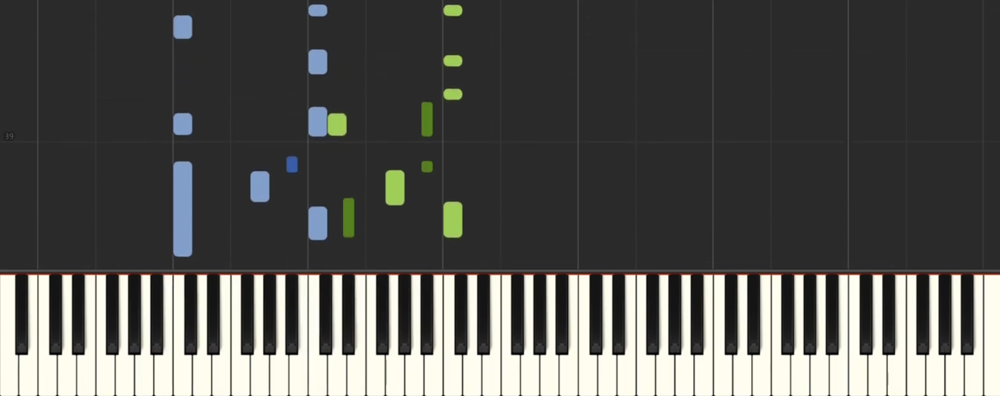
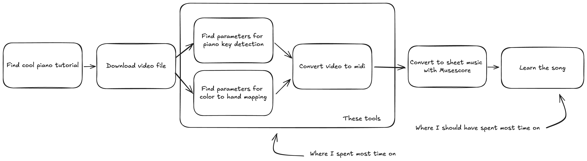
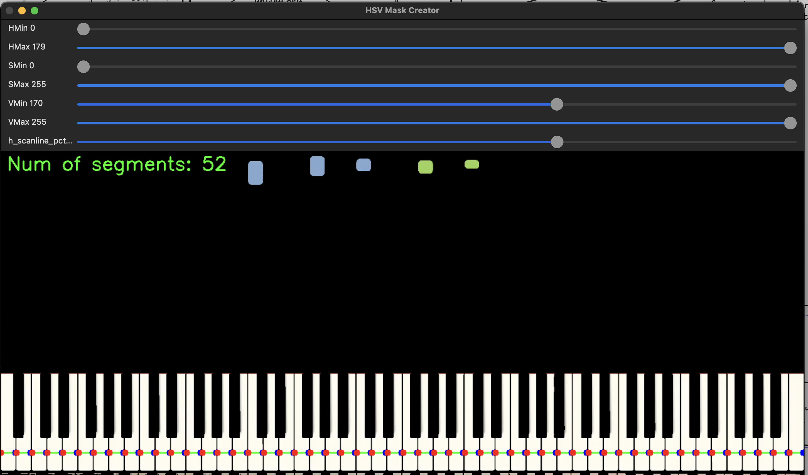
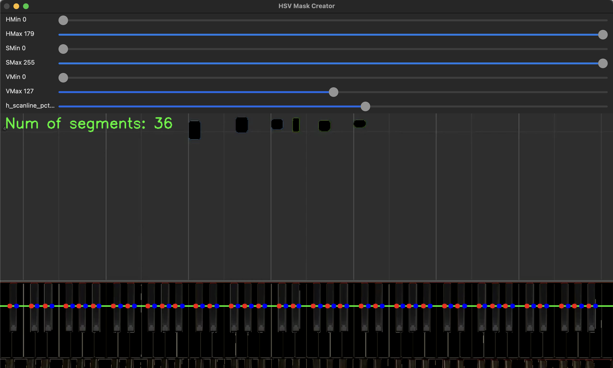

# Piano MIDI Tools

Convert Synthesia-based piano tutorials to MIDI files with ease!



## 🎹 Overview

Many talented musicians create amazing covers of existing songs but don't provide sheet music. This tool bridges that gap by helping you convert [Synthesia](https://synthesiagame.com/) piano tutorials to MIDI files. These MIDI files can then be transformed into sheet music using tools like [MuseScore](https://musescore.org/en).

For more background on this project, check out the [blog post on my website](https://blog.evanraalte.nl/).

## 🚀 Features

- Color picker: Select 'pressed' key colors for left and right hands
- Key picker: Identify black and white key segments in the video
- Video-to-MIDI converter: Transform video tutorials into playable MIDI files
- Integration with [`yt-dlp`](https://github.com/yt-dlp/yt-dlp) for easy video downloading

## 🏗️ Project Structure



The project consists of three main components:

1. **Color Picker**: Extract color parameters for pressed keys
2. **Key Picker**: Identify piano key segments in the video
3. **Video-to-MIDI Converter**: Generate MIDI files from video tutorials

These tools work together to create a seamless conversion process, guided by YAML configuration files.

## 🛠️ Installation

1. Clone this repository:
   ```bash
   git clone https://github.com/yourusername/piano-midi-tools.git
   cd piano-midi-tools
   ```

2. Install dependencies using [uv](https://docs.astral.sh/uv/):
   ```bash
   uv sync
   ```

## 🎵 Usage

### Color Picker

```bash
uv run main.py color-picker --video-path test.mp4 --colors-path colors.yaml --frame-end 250
```


Use the keyboard to save color ranges:
- Left white: 'q' (load) / '1' (save)
- Left black: 'w' (load) / '2' (save)
- Right white: 'e' (load) / '3' (save)
- Right black: 'r' (load) / '4' (save)

Exit the tool by pressing `ESC`.

### Key Picker

```bash
uv run main.py key-picker --video-path test.mp4 --key-segments-path keys.yaml
```

The Key Picker tool helps you identify white and black key segments in the video. Here's how to use it:

1. Adjust the green bar to align with piano keys:
   - Click directly on the video image to move the green bar to that position, or
   - Use the slider called 'h_scanline_pct'
2. Modify filters to isolate white keys (52 segments)
3. Press 'w' to save white key segments
4. Repeat the process for black keys (36 segments)
5. Press 'b' to save black key segments
6. Press 'ESC' to exit the application

| White Key Selection | Black Key Selection |
|---------------------|---------------------|
|  |  |

For white keys:
- Adjust filters to mask out everything but the white keys
- Aim for 52 segments (the number of white keys on a standard piano)
- Press 'w' to save once you have 52 segments (it won't save otherwise)

For black keys:
- Adjust filters and line to isolate black keys
- Aim for 36 segments (the number of black keys on a standard piano)
- Press 'b' to save once you have 36 segments (it won't save otherwise)

Remember, you can always readjust the green bar by clicking on the image or using the slider if needed.

### Video-to-MIDI Converter

```bash
uv run main.py video-to-midi --video-path test.mp4 --key-segments-path keys.yaml --colors-path colors.yaml --midi-path output.midi
```

This will process the video and generate a MIDI file based on the detected key presses.

## 🎼 Next Steps

After generating your MIDI file, import it into MuseScore or your preferred notation software to create sheet music. Happy practicing!

## 📝 Notes

- This project is a reimagining of a [previous attempt](https://github.com/evanraalte/piano_tutorial_to_midi). While the earlier version focused on creating a comprehensive, all-in-one tool with a complex user interface, this new iteration prioritizes core functionality and simplicity.
- The current version provides a set of streamlined utilities that users can combine as needed, avoiding feature creep and enhancing overall usefulness.
- The tools use basic OpenCV primitives for simplicity and efficiency.

## 🤝 Contributing

Contributions, issues, and feature requests are welcome! Feel free to check the [issues page](https://github.com/evanraalte/piano_midi/issues) if you want to contribute.

## 📄 License

This project is licensed under the [MIT License](LICENSE).
