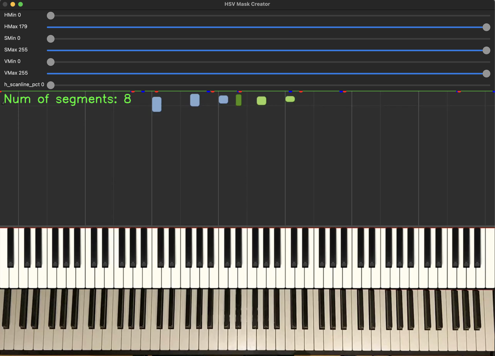

# Piano midi tools

Some people do amazing covers of existing songs, but don't sell any sheet music.. This tool aids you to convert [Synthesia](https://synthesiagame.com/) based piano tutorials to midi files. Midi files can be converted to sheet music with tools like [Musescore](https://musescore.org/en). I also wrote a blog post with more background on this on [my website](https://blog.evanraalte.nl/). I actually made a tool to do this [before](https://github.com/evanraalte/piano_tutorial_to_midi), but most of the time was actually spend on the user interface. This caused feature creep, which harmed the actual usefulness of the application. This time I tried to keep it a lot simpler. No more fancy do-it-all application, but a set of utilities that you can use as you see fit.


## 🚁 Structure
There are three main parts to this utility.
- A tool to select the 'pressed' colors, that are mapped to either the left or right hand (`color-picker`)
- A tool to find black and white key segments in the video (`key-picker`)
- A tool to convert a video to a midi file (`video-to-midi`)
- (external) [`yt-dlp`](https://github.com/yt-dlp/yt-dlp), to help you with gathering material that you want to convert.

The first two tools are used to extract parameters (in `yaml` format), that are used to do the video to midi conversion. This diagram hopefully explains it better:


## Installation

First clone this repo. The dependencies are managed by [uv](https://docs.astral.sh/uv/). Once you enter the root of this project. Simply run: `uv sync` to install all neccesary dependencies. From there, you are all set!

## Running the applications

The aforementioned tools are ran using commands, e.g.:

Every one of these commands has a help, which explains what you need to provide.

``` bash
uv run main.py color-picker <args>
uv run main.py key-picker <args>
uv run main.py video-to-midi <args>
```

### Color-picker

Even though most development time on the last version was spent on the UI, my skillset in this field is quite limited. That is why I decided to stick with some simple OpenCV primitives.

The app is started like this:
```bash
uv run main.py color-picker --video-path test.mp4 --colors-path colors.yaml --frame-end 250
```
After that, It presents you with an ui like this:


It takes a 'slice' from each of the 250 frames, so that you hopefully get a good representation of all four colors.

Your job is to select HSV color ranges, such that only one of the four colors in the original image is visible and the rest is blackened out. If you click on the original image, it tries to find filters for you automagically. You might need to adjust those. In the example above, I filtered on the black keys of the right hand. We have for colors to save. You may ask how is that done in this primitive OpenCV layout?
The answer is simple, you use your keyboard like they did in the old days.
- Left white: 'q' / '1' to load/save
- Left black 'w' / '2' to load/save
- Right white: 'e' / '3' to load/save
- Right black: 'r' / '4' to load/save (so to store our filter for black key/right hand, we'd use this one)

After saving, the color ranges are stored in `colors.yaml`, e.g.:
```yaml
right_black:
  h:
    max: 54
    min: 34
  s:
    max: 255
    min: 188
  v:
    max: 184
    min: 104
```

This file is the first dependency for our video conversion! Exit the tool by pressing `ESC`.

### Key-picker

The key picker is used to create key segments, that are needed to distinguish piano keys in the video conversion. The UI is started like this:
```bash
uv run main.py key-picker --video-path test.mp4 --key-segments-path keys.yaml
```

And it looks like this:


It looks a bit like the previous UI, but this time you have to first move the green bar (you can use the slider or clikc) to the piano keys, and then adjust the filters such that it masks out everything but the white keys. You should end up with 52 segments:


Then press 'w' to save (it only allows you if you have 52 segments, ie the number of white keys).

For black we do the save, adjust the filter and line:


Then press 'b' to save (we expect 36 segments this time)


### Video-to-midi

Finally, we are ready to start the conversion:
```bash
uv run main.py video-to-midi --video-path test2.mp4 --key-segments-path keys.yaml --colors-path colors.yaml --midi-path output2.midi
```

You then see logs like:
```
Starting video to midi with image path: test2.mp4
Key 27 (C3) pressed by Hand.LEFT
during frame 56
Key 27 (C3) released by Hand.LEFT
during frame 81
Key 34 (G3) pressed by Hand.LEFT
during frame 82
Key 34 (G3) released by Hand.LEFT
during frame 93
Key 27 (C3) pressed by Hand.LEFT
during frame 96
Key 38 (B3) pressed by Hand.LEFT
Key 27 (C3) released by Hand.LEFT
during frame 125
```

And finally, a midi file is stored. We're done! The midi file you can import in Musescore. Happy practicing!
